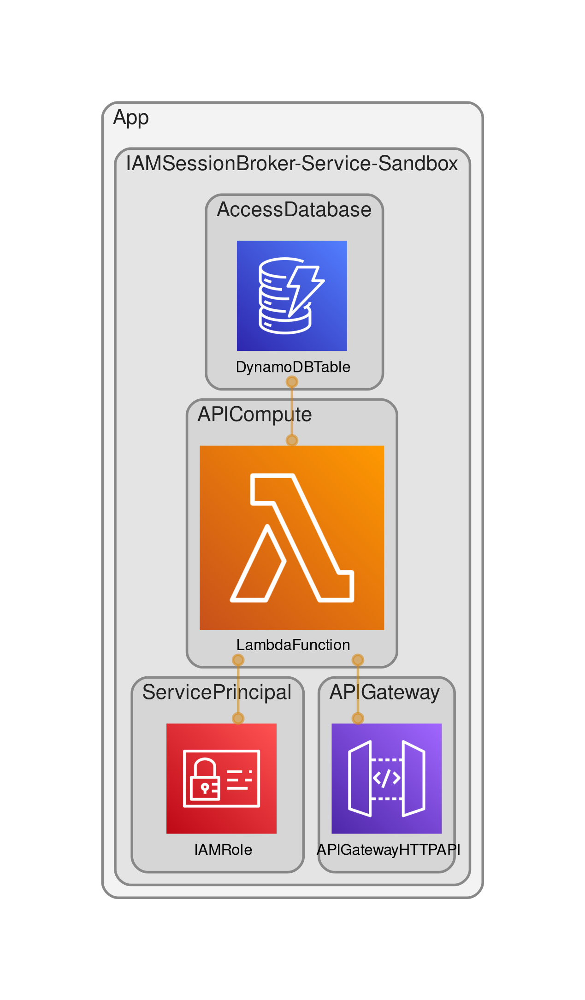

# IAM Session Broker
Returns scoped temporary security credentials for registered applications.



\* Diagram generated using https://github.com/pistazie/cdk-dia

## Clone code
```bash
git clone https://github.com/applicationdesignframework/iam-session-broker
cd iam-session-broker
```

## Configure development environment
```bash
python3.9 -m venv .venv
source .venv/bin/activate

# [Optional] Needed to upgrade dependencies and cleanup unused packages
# Pinning pip-tools to 6.4.0 and pip to 21.3.1 due to
# https://github.com/jazzband/pip-tools/issues/1576
pip install pip-tools==6.4.0
pip install pip==21.3.1

toolchain/scripts/install-deps.sh
toolchain/scripts/run-tests.sh
```

## [Optional] Upgrade AWS CDK CLI version
The application uses Node Package Manager (npm) and `package.json` configuration file to install AWS CDK CLI locally. To find the latest AWS CDK CLI version: `npm view aws-cdk-lib version`.

```bash
vi package.json  # Update the "aws-cdk" package version
```

```bash
toolchain/scripts/install-deps.sh
toolchain/scripts/run-tests.sh
```

## [Optional] Upgrade dependencies (ordered by constraints)
Consider [AWS CDK CLI](https://docs.aws.amazon.com/cdk/v2/guide/versioning.html#cdk_toolkit_versioning) compatibility when upgrading AWS CDK library version.

```bash
pip-compile --upgrade service/api/app/requirements.in
pip-compile --upgrade requirements.in
pip-compile --upgrade requirements-dev.in
```

```bash
toolchain/scripts/install-deps.sh
toolchain/scripts/run-tests.sh
```

## [Optional] Cleanup unused packages
```bash
pip-sync service/api/app/requirements.txt requirements.txt requirements-dev.txt
```

## Deploy service stack
The `IAMSessionBroker-Service-Sandbox` stack uses your default AWS account and region.

```bash
npx cdk deploy IAMSessionBroker-Service-Sandbox
```

Example output:
```
 ✅  IAMSessionBroker-Service-Sandbox

Outputs:
IAMSessionBroker-Service-Sandbox.APIEndpoint = https://jcyr7ckk5e.execute-api.eu-west-1.amazonaws.com/
IAMSessionBroker-Service-Sandbox.ServicePrincipalRoleName = IAMSessionBroker
```

## Test service
### Install awscurl
https://github.com/okigan/awscurl

### Deploy dependencies
Deploy the Identity Provider:
https://github.com/applicationdesignframework/identity-provider

### Configure inputs
Follow the instructions in Identity Provider `README.md` to register a user with 
the `Yellow` tenant ID and any role (e.g. `Admin`). Get the user ID token by signing in.

```bash
_user_jwt="USER_ID_TOKEN"
```
```bash
_user_tenant_id="Yellow"
_other_tenant_id="Blue"

_user_pool_id=$(aws cloudformation describe-stacks \
  --stack-name IdentityProvider-Service-Sandbox \
  --query 'Stacks[*].Outputs[?OutputKey==`CognitoUserPoolID`].OutputValue' \
  --output text)

_account=$(aws sts get-caller-identity --query Account --output text)
_region=$(aws configure get region)
_bucket="isb-${_account}-${_region}"

_isb_service_api_endpoint=$(aws cloudformation describe-stacks \
  --stack-name IAMSessionBroker-Service-Sandbox \
  --query 'Stacks[*].Outputs[?OutputKey==`APIEndpoint`].OutputValue' \
  --output text)
  
_isb_service_principal_role_name=$(aws cloudformation describe-stacks \
  --stack-name IAMSessionBroker-Service-Sandbox \
  --query 'Stacks[*].Outputs[?OutputKey==`ServicePrincipalRoleName`].OutputValue' \
  --output text)

_app_service_principal_role_name="AppService"
_app_access_principal_role_name="AppAccess"
_session_tag_key="TenantID"
_jwt_claim_name="custom:tenant_id"
```

### Create application access principal role
The inline policy grants access to Amazon S3 objects and uses `TenantID` principal tag 
to enforce tenant boundary.

```bash
cat > app_access_principal_role_trust_policy.json <<EOF
{
  "Version": "2012-10-17",
  "Statement": [
    {
      "Effect": "Allow",
      "Principal": {
         "AWS": "arn:aws:iam::${_account}:role/${_isb_service_principal_role_name}"
      },
      "Action": [
         "sts:AssumeRole",
         "sts:TagSession"
      ]
    }
  ]
}
EOF
cat > app_access_principal_role_inline_policy.json <<EOF
{
    "Version": "2012-10-17",
    "Statement": [
        {
            "Sid": "S3Access",
            "Effect": "Allow",
            "Action": "s3:GetObject",
            "Resource": "arn:aws:s3:::${_bucket}/\${aws:PrincipalTag/TenantID}/*"
        }
    ]
}
EOF
aws iam create-role \
    --role-name ${_app_access_principal_role_name} \
    --assume-role-policy-document file://app_access_principal_role_trust_policy.json
aws iam put-role-policy \
    --role-name ${_app_access_principal_role_name} \
    --policy-name ${_app_access_principal_role_name} \
    --policy-document file://app_access_principal_role_inline_policy.json
```

### Create application service principal role
The inline policy allows to call any Amazon API Gateway endpoint in the account and Region, 
including the IAM Session Broker service API endpoint which uses Amazon API Gateway.

```bash
cat > app_service_principal_role_trust_policy.json <<EOF
{
    "Version": "2012-10-17",
    "Statement": [
        {
            "Effect": "Allow",
            "Principal": {
                "AWS": "arn:aws:iam::${_account}:root"
            },
            "Action": "sts:AssumeRole"
        }
    ]
}
EOF
cat > app_service_principal_role_inline_policy.json <<EOF
{
    "Version": "2012-10-17",
    "Statement": [
        {
            "Effect": "Allow",
            "Action": "execute-api:Invoke",
            "Resource": "arn:aws:execute-api:${_region}:${_account}:*/*"
        }
    ]
}
EOF
aws iam create-role \
    --role-name ${_app_service_principal_role_name} \
    --assume-role-policy-document file://app_service_principal_role_trust_policy.json
aws iam put-role-policy \
    --role-name ${_app_service_principal_role_name} \
    --policy-name ${_app_service_principal_role_name} \
    --policy-document file://app_service_principal_role_inline_policy.json
```

### Get application service principal role credentials
```bash
_app_service_principal_role_credentials=$(aws sts assume-role \
    --role-arn arn:aws:iam::${_account}:role/${_app_service_principal_role_name} \
    --role-session-name ${_app_service_principal_role_name} \
    --query 'Credentials.[AccessKeyId,SecretAccessKey,SessionToken]' \
    --output text)
```

### Register the application with IAM Session Broker
**Note:** `${_isb_service_api_endpoint}applications` doesn't include `/` on purpose, because endpoint attribute already includes `/`. Adding `/` would result in access denied due to `//` in the API resource path.

```bash
env \
    $(echo ${_app_service_principal_role_credentials} | \
    awk '{printf "AWS_ACCESS_KEY_ID=%s AWS_SECRET_ACCESS_KEY=%s AWS_SESSION_TOKEN=%s",$1,$2,$3}') \
        awscurl --region ${_region} -X POST -d "{ \
            \"AccessPrincipalRoleName\": \"${_app_access_principal_role_name}\", \
            \"SessionTagKey\": \"${_session_tag_key}\", \
            \"JWTClaimName\": \"${_jwt_claim_name}\", \
            \"JWKSetURL\": \"https://cognito-idp.${_region}.amazonaws.com/${_user_pool_id}/.well-known/jwks.json\" \
        }" "${_isb_service_api_endpoint}applications"
```

### Create application bucket with objects for two tenants
```bash
aws s3 mb s3://${_bucket}
aws s3api put-object --bucket ${_bucket} --key ${_user_tenant_id}/file.txt --content-length 0
aws s3api put-object --bucket ${_bucket} --key ${_other_tenant_id}/file.txt --content-length 0
```

### Get application access principal role credentials
**Note:** `${_isb_service_api_endpoint}applications` doesn't include `/` on purpose, because endpoint attribute already includes `/`. Adding `/` would result in access denied due to `//` in the API resource path.

```bash
env \
    $(echo ${_app_service_principal_role_credentials} | \
    awk '{printf "AWS_ACCESS_KEY_ID=%s AWS_SECRET_ACCESS_KEY=%s AWS_SESSION_TOKEN=%s",$1,$2,$3}') \
        awscurl --region ${_region} -X GET "${_isb_service_api_endpoint}credentials?jwt=${_user_jwt}" \
            > app_access_principal_role_credentials.json
```

### Test access
You should have access to "Yellow" prefix per app access role policy.

```bash
env \
    AWS_ACCESS_KEY_ID=$(cat app_access_principal_role_credentials.json | jq -r .AccessKeyId) \
    AWS_SECRET_ACCESS_KEY=$(cat app_access_principal_role_credentials.json | jq -r .SecretAccessKey) \
    AWS_SESSION_TOKEN=$(cat app_access_principal_role_credentials.json | jq -r .SessionToken) \
        aws s3api get-object --bucket ${_bucket} --key ${_user_tenant_id}/file.txt ${_user_tenant_id}-file.txt
```

You should get "Access Denied" to "Blue" prefix per app access role policy.

```bash
env \
    AWS_ACCESS_KEY_ID=$(cat app_access_principal_role_credentials.json | jq -r .AccessKeyId) \
    AWS_SECRET_ACCESS_KEY=$(cat app_access_principal_role_credentials.json | jq -r .SecretAccessKey) \
    AWS_SESSION_TOKEN=$(cat app_access_principal_role_credentials.json | jq -r .SessionToken) \
        aws s3api get-object --bucket ${_bucket} --key ${_other_tenant_id}/file.txt ${_other_tenant_id}-file.txt
```

### Deregister application
**Note:** `${_isb_service_api_endpoint}applications` doesn't include `/` on purpose, because endpoint attribute already includes `/`. Adding `/` would result in access denied due to `//` in the API resource path.

```bash
env \
    $(echo ${_app_service_principal_role_credentials} | \
    awk '{printf "AWS_ACCESS_KEY_ID=%s AWS_SECRET_ACCESS_KEY=%s AWS_SESSION_TOKEN=%s",$1,$2,$3}') \
        awscurl --region ${_region} -X DELETE "${_isb_service_api_endpoint}applications"
```

### Delete bucket
```bash
aws s3 rm s3://${_bucket} --recursive
aws s3 rb s3://${_bucket}
```

### Delete roles
```bash
aws iam delete-role-policy \
    --role-name ${_app_access_principal_role_name} \
    --policy-name ${_app_access_principal_role_name}
aws iam delete-role --role-name ${_app_access_principal_role_name}
aws iam delete-role-policy \
    --role-name ${_app_service_principal_role_name} \
    --policy-name ${_app_service_principal_role_name}
aws iam delete-role --role-name ${_app_service_principal_role_name}
```

### Delete temporary files
```bash
rm app_service_principal_role_trust_policy.json
rm app_service_principal_role_inline_policy.json
rm app_access_principal_role_trust_policy.json
rm app_access_principal_role_inline_policy.json
rm app_access_principal_role_credentials.json
rm Yellow-file.txt
```

## Delete service stack
**Do not forget to delete the stack to avoid unexpected charges**
```bash
npx cdk destroy IAMSessionBroker-Service-Sandbox
```
